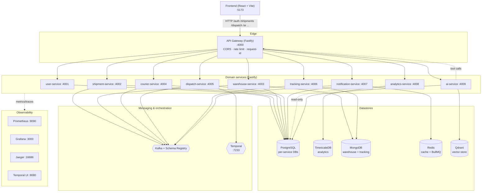

# SmartLogistics

SmartLogistics is a microservices-based logistics orchestration platform. It models the full operational lifecycle of a parcel network — shipments, dispatch workflows, warehouses, couriers, returns/exceptions, event streaming, analytics, and an AI operations assistant — behind a single API gateway and a modern React operations console.

---

## 1. Project overview

The platform is a `pnpm` + Turborepo monorepo composed of independently deployable Fastify services, a set of shared TypeScript packages, and a Vite/React frontend. Each domain service owns its own database; services communicate over HTTP through the gateway and asynchronously over Kafka, with long-running orchestration handled by Temporal and background jobs by BullMQ/Redis.

Key capabilities:

- **Operations console** — Overview, Shipments, Dispatch monitor, Warehouses, Couriers, Returns/Exceptions, Events & queues, Analytics, and Observability pages.
- **Role-based access control** — Admin, Warehouse Operator, Customer Support, and Courier roles see only the pages they are permitted to.
- **Date-range filtering** — every page defaults to "today" and supports Today / 7d / 30d / 90d presets plus a custom range; servers filter on real timestamps.
- **Live analytics** — business metrics (KPIs, time-series, histograms, SLA, regions, exception zones) are recomputed live from shipment data per selected range.
- **Orchestrated dispatch** — dispatch runs as a Temporal workflow (validate → reserve → label → assign → track → dispatch) executed by an in-process worker, with a graceful inline fallback when Temporal is unavailable.
- **Event-driven fan-out** — on dispatch completion the platform publishes to Kafka and three independent consumer groups react: tracking records a milestone, analytics counts the event, and notification queues a customer update via BullMQ.
- **AI assistant** — a Groq-backed streaming assistant with tool-calling against live operational data, plus live operational recommendations.
- **Metrics & observability** — every service exposes Prometheus metrics at `/metrics` (scraped by Prometheus, visualized in Grafana); Jaeger and Temporal UI are provisioned for traces and workflow inspection.

### Implementation notes

A couple of areas are deliberately scoped so the demo stays runnable end-to-end:

- **Distributed traces** — services emit Prometheus metrics today; OpenTelemetry/Jaeger trace export is provisioned in infra but not yet wired into the service code.
- **Semantic retrieval** — Qdrant is provisioned and an `ai.embedding.trigger` consumer is in place, but the assistant currently answers via **live tool-calling** against the services (9 typed ops tools) rather than vector search. This trades retrieval staleness for always-fresh data and is the intended substitution for Part B retrieval.

### Workspace layout

```
apps/
  frontend/            React + Vite operations console
  services/
    api-gateway/       Edge router, CORS, rate limiting
    user-service/      Auth, users, RBAC source
    shipment-service/  Shipments, returns, exceptions, timeline, audit
    warehouse-service/ Warehouses, lanes, stock
    courier-service/   Courier roster + assignment
    dispatch-service/  Temporal dispatch workflows + KPIs
    tracking-service/  Kafka/Mongo event stream, DLQ
    notification-service/ BullMQ notification delivery log
    analytics-service/ Live business metrics + observability snapshots
    ai-service/        Groq assistant, tools, suggestions
packages/
  shared-config/  shared-errors/  shared-events/  shared-middleware/  shared-types/
infra/
  prometheus/  grafana/  jaeger/  qdrant/
scripts/
  seed.ts        Deterministic data seeding across all stores
```

---

## 2. Architecture diagram



---

## 3. Setup instructions

### Prerequisites

- Node.js >= 20
- pnpm 10 (`corepack enable` or `npm i -g pnpm`)
- Docker + Docker Compose

### Install & configure

```bash
pnpm install
cp .env.example .env   # then fill in secrets (e.g. GROQ_API_KEY)
```

### Run everything (infra + all dev servers)

```bash
pnpm dev
```

`pnpm dev` runs `docker compose up -d` (databases, Kafka, Temporal, Redis, Qdrant, observability) and then starts every service and the frontend in parallel via Turborepo.

- Frontend: <http://localhost:5173>
- API gateway: <http://localhost:4000>
- Grafana: <http://localhost:3000> · Jaeger: <http://localhost:16686> · Temporal UI: <http://localhost:8080>

### Seed demo data

With the databases running:

```bash
pnpm seed
```

This truncates and repopulates all stores with ~90 days of timestamp-distributed data so the date-range filters and analytics are meaningful. The primary admin account is `awais.ali@smartlogistics.example` (demo password is set via `DEMO_PASSWORD`).

### Useful scripts

| Command | Description |
| --- | --- |
| `pnpm dev` | Start infra + all dev servers |
| `pnpm up` / `pnpm down` | Start / stop docker infra only |
| `pnpm seed` | Reseed all databases |
| `pnpm build` | Build all packages and apps |
| `pnpm typecheck` | Type-check the whole workspace |
| `pnpm test` | Run the unit suite (Vitest) on critical paths |
| `pnpm smoke` | Typecheck + unit tests + docker-compose validation |
| `pnpm lint` | Lint across the workspace |

> Individual services run on ports `4001`–`4009`; PostgreSQL instances are exposed on `5433`–`5441`, TimescaleDB on `5439`, MongoDB on `27017`/`27018`.

---

## 4. API overview

All client traffic goes through the gateway at `http://localhost:4000`, which proxies by path prefix to the owning service. Most list/metrics endpoints accept optional `from`/`to` ISO query params and **default to today** when omitted.

| Prefix | Service | Notable endpoints |
| --- | --- | --- |
| `/auth` | user-service | `POST /auth/login`, `/auth/register`, `/auth/refresh`, `/auth/logout` |
| `/users` | user-service | `GET /users`, `PATCH /users/:id/role` |
| `/shipments` | shipment-service | `GET /` (range), `GET /:id`, `/:id/timeline`, `/:id/audit`, `/returns`, `/exceptions`, `/returns/metrics`, `/exceptions/taxonomy`, `POST /:id/escalate`, `POST /:id/actions` |
| `/warehouses` | warehouse-service | `GET /` (range), `GET /:id/lanes`, `GET /:id/stock`, inventory reserve/release/adjust |
| `/couriers` | courier-service | `GET /` (range), `POST /`, `POST /assign`, `PATCH /:id/status` |
| `/dispatch` | dispatch-service | `GET /workflows` (range), `GET /kpis` (range), `GET /failure-modes`, `POST /:workflowId/replay\|skip\|terminate`, `GET /:workflowId/audit` |
| `/tracking` | tracking-service | `GET /events/recent` (range), `/topics`, `/consumers`, `/queues/celery`, `/dlq/messages` (range), `/dlq/replays` (range), `/events/kpis` |
| `/notifications` | notification-service | `GET /:id`, `POST /retry/:id` |
| `/analytics` | analytics-service | `GET /kpis/overview`, `/shipments/timeseries`, `/shipments/histogram`, `/regions/volume`, `/sla/breakdown`, `/exceptions/zones` (all range-aware) + `/observability/*` snapshots |
| `/ai` | ai-service | `POST /assistant/stream` (SSE), `GET /assistant/history`, `DELETE /assistant/history`, `GET /suggestions`, `POST /suggestions/refresh`, `POST /suggestions/:id/feedback`, `GET /info` |

Every service also exposes `GET /health` and `GET /metrics` (Prometheus). Example:

```bash
# Today's shipments (default range)
curl http://localhost:4000/shipments

# Shipments for an explicit range
curl "http://localhost:4000/shipments?from=2026-03-01T00:00:00Z&to=2026-05-30T23:59:59Z"

# Login
curl -X POST http://localhost:4000/auth/login \
  -H 'content-type: application/json' \
  -d '{"email":"awais.ali@smartlogistics.example","password":"<DEMO_PASSWORD>"}'
```

---

## 5. Technology stack

**Monorepo & tooling**
- pnpm workspaces, Turborepo, TypeScript, tsx, ESM

**Frontend** (`apps/frontend`)
- React 18, Vite 5, TanStack Router, TanStack Query, Zustand
- Tailwind CSS, Radix UI primitives, lucide-react, Recharts
- React Hook Form + Zod resolvers, Axios

**Backend services** (`apps/services/*`)
- Fastify (with `@fastify/http-proxy`, `@fastify/cors`, `@fastify/rate-limit`)
- Zod for validation, shared middleware (Pino logging, request IDs)
- Temporal (dispatch workflows), BullMQ (notification jobs)
- Vercel AI SDK (`ai`) + `@ai-sdk/groq` for the AI assistant and recommendations

**Data & messaging**
- PostgreSQL 16 (per-service databases), TimescaleDB (analytics)
- MongoDB 7 (warehouse + tracking), Redis 7 (cache + BullMQ)
- Apache Kafka + Confluent Schema Registry, Qdrant (vector store)

**Observability**
- Prometheus, Grafana, Jaeger (OpenTelemetry OTLP), Temporal UI

**Infrastructure**
- Docker Compose for all infra and (optionally) containerized services
